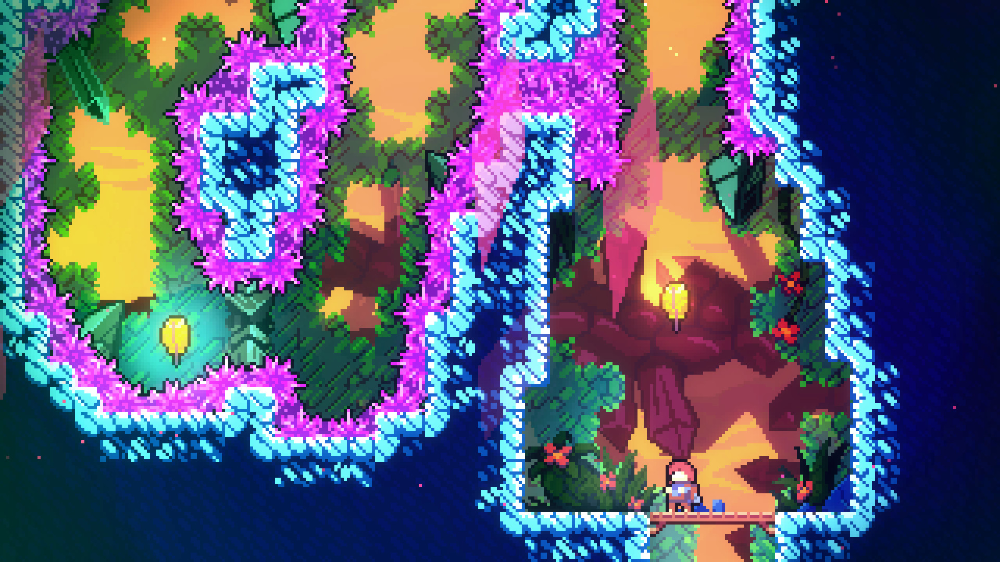
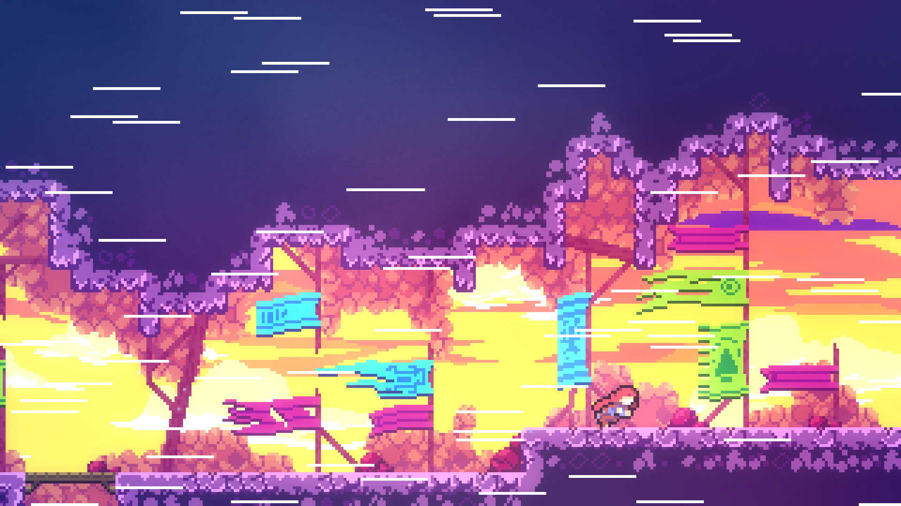
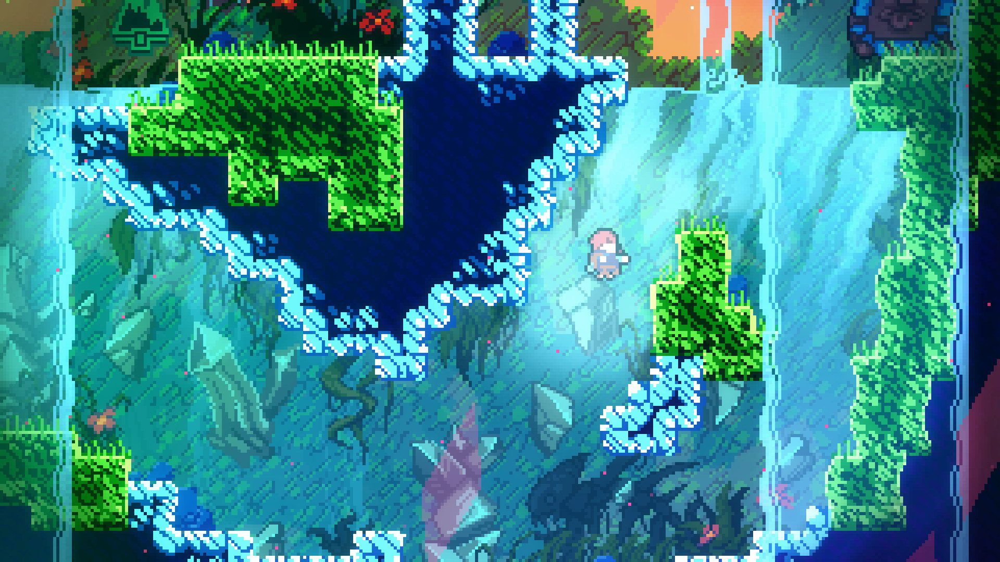
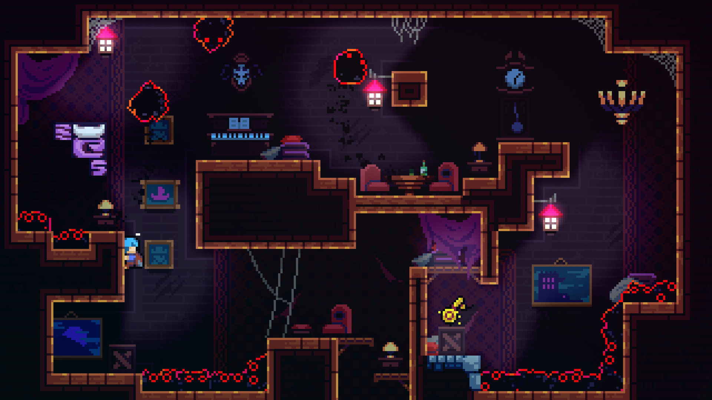
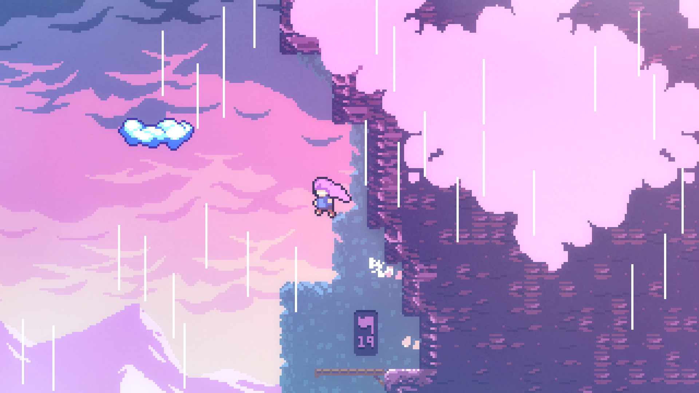
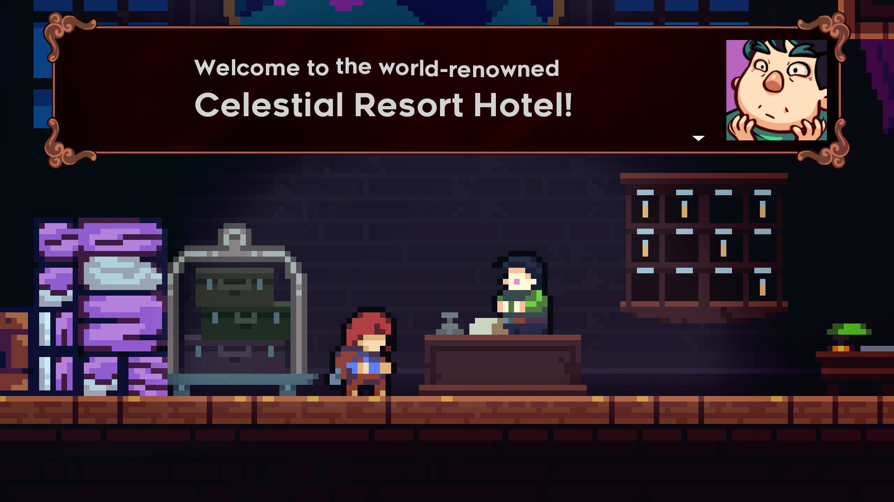

## Celeste
Celeste is a challenging platformer adventure game for Steam, itch.io, Nintendo Switch, Playstation 4, Xbox One, and Epic Launcher. The [official website](https://www.celestegame.com/) has a link for all these versions. 

## Pacifist Rating
Below is the rating I give Celeste based upon the actions you must complete for a Pacifist run. Please check out the [What is a Pacifist Page](/posts/what-is-a-pacifist/) for more information to what each one means. 
| HP | PP | KP | NP | GP | TP |
|----|----|----|----|----|----|
|**Yes**|**Yes**|**Yes**| **Yes**| Default |_N/A_|

* HP: Nothing to hurt.
* PP: Nothing to kill.
* KP: The default run is pacifist.
* NP: You will not kill anyone.
* GP: Pacifist is the only run type. 
* TP: No tutorials in the game. (Not Applicable)

### Emotional Damage
While there is nothing to fight in this game, you will experience an emotional story if you follow and pay attention to the details. There are a lot of little hints and nuances that game provides you as the story progresses that will play on the mood. 

Even if you decide to skip the story (Which I strongly don't suggest), the challenge of completing the game 100% will push you to the limits. Assuming you don't use the in-game assist functionality that is provided.

## Why Celeste
Celeste is one of my favorite platformers and it's one I wish the world as a whole would play some day. The story and challenge of the game has a perfect balance for me that I can recommend it to anyone. Additionally, even if it is too challenging for you, there is the assist option that you can use to progress and experience the story still.

In addition, this game by default is a pacifist game. There is no concern about 'messing up the run' or anything of that nature when the entire run is pacifist. 

### The Music
The music for Celeste is breath taking. [Lena Raine](https://en.wikipedia.org/wiki/Lena_Raine) does an amazing job setting the tone and mood of what is happening in the game. If you are not familiar with Lena, there is nothing wrong with that. Lena's most played track per Spotify is "[Pigstep](https://www.youtube.com/watch?v=BTthtlT80Rc)" for Minecraft with over 43 million average monthly listeners as of writing this. She's also had a hand in other popular games such as Guild Wars 2 and Dealtarune. 

## Other Celeste Versions
* [Celeste Classic](https://maddymakesgamesinc.itch.io/celesteclassic): **Free** - The original idea/concept for Celeste in which the game was based upon. 
* [Celeste Classic 2](https://maddymakesgamesinc.itch.io/celeste-classic-2): **Free** - A 3rd anniversary game jam creation for fans of the PICO-8 original. 
* [Celeste64 Fragments of the Mountain](https://maddymakesgamesinc.itch.io/celeste64): **Free** - A 6th anniversary game jam creation for fans.

## Screen Shots

  
  
  
  
  
  

