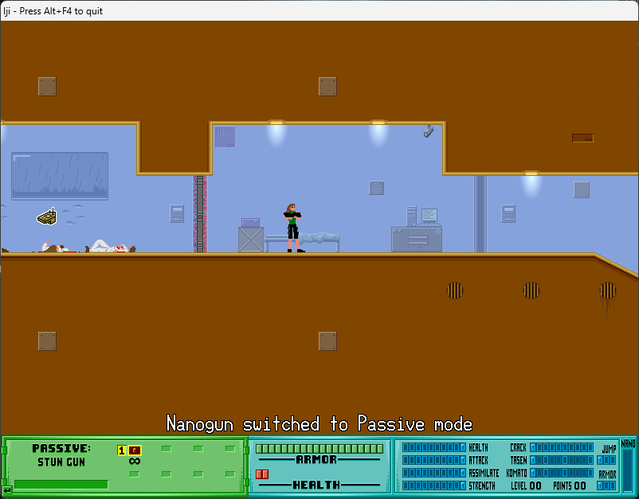

Iji and what you need to know about it!

## Iji by Remar Games
Iji is an action/platformer released on PC for free in 2008 by (Daniel) Remar Games. As a gamer, I love to suggest this game to anyone who plays games as I love the premise of the story and the gameplay. 

## Iji Website
To download the latest version of Iji, head over to the [Remar Game website](https://www.remar.se/daniel/iji.php) and download the latest version of the game. As of July 11th, 2021 the latest version of Iji is 1.8. (Meaning this free game has been supported with updates for 13 years!)

Daniel has stated that he will "not update the game unless I'm feeling like it." So, it is unknown if a version past 1.8 will happen or not. It has been stated in the past that he had no plans to do a version 1.8, however we have this version!

### DirectPlay
DirectPlay is required to run Iji. When first running the game, you should be prompted to install the feature. 

## Pacifist Rating
Below is the rating I give Iji based upon the actions you must complete for a Pacifist run. Please check out the [What is a Pacifist Page](/posts/what-is-a-pacifist/) for more information to what each one means. 
| HP | PP | KP | NP | GP | TP |
|----|----|----|----|----|----|
|_No_|_No_|**Yes***| **Yes**| **Yes**|_N/A_|

* HP: You have to inflict damage on targets to progress the game.
* PP: You have to inflict pain on targets to progress the game.
* KP: You will not kill anyone to complete the Pacifist run.
  * *Entities will commit seppuku.
* NP: You will not kill anyone to complete the Pacifist run. (See KP however)
* GP: There is a pacifist finish to the game.
* TP: No tutorials in the game. (Not Applicable)

## Pacifist Character
Yes, it is possible to play a Pacifist character in Iji. Doing so will make the gameplay harder, but more rewarding.

There are certain events in the game that you must complete in order to play a full pacifist run. Let's take a look at the requirements below to see exactly how; 

### Requirements
Playing a pacifist is mostly straight forward in Iji. Don't kill any living entity (Humans, Komado, or Tasen), however you can destroy robots and machines. 

Major Events;
* Elite Krotera: Wait 10 minutes
* Assassin Asha (First Encounter): You will have to attack and try to 'kill' them, however they will teleport out when almost dead.
* Giant Sentry: It's a machine, so you will have to destroy it.
* Trap Mine: Dan is kidnapped by Asha. You must place the Trap Mine at the end of the level to prevent Asha from teleporting in. (Doesn't kill anyone, however if you do not place the trap mine, you will be forced to kill someone.)
* Iosa: If your kill count is under 50 (Which it is!), Assassin Ansaksie will assist you and end up killing Iosa after you remove her shield.
* Assassin Asha (Third Encounter): You must destroy the generator before engaging in the fight. Failure to do so will force you to kill Asha. To destroy the generator, you must have 10 Crack, 10 Komado, and 10 Tasen to create the 'Velocithor'. To create this, you must combine the best Komado and Tasen weapons (#4/#8 on hotbar) at a Nanoweapon system and complete the level 10 crack to make it.
* Tor: Fight him with your special weapon, Massacre, and remove his armor. After removal of his armor, he will off himself without you needing to dirty your hands.

The first 2-5 kills that Iji does, you will hear her say "I'm sorry" in a soft voice in which she regrates killing anyone. If you ever hear the voice line, you've killed something. Additionally, at the end of a level, it will display your kill count. If you ever see a number above 0, then you killed something and voided the pacifist run.

## Tips
Pressing "Enter" on your keyboard will switch your Nanogun to passive mode, preventing you from killing.

## Screenshots
Below are some screenshots of Iji;

