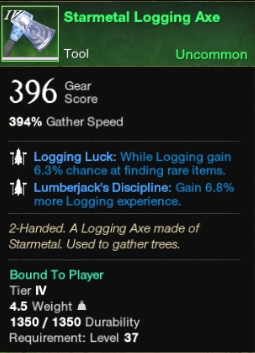
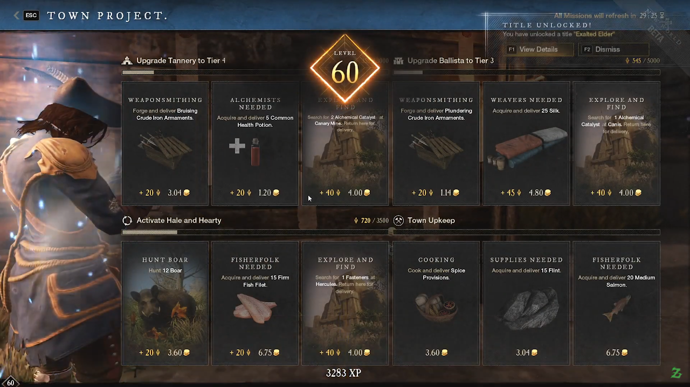


New World and what you need to know about it!


## New World by Amazon Games
New World is an MMORPG released on PC September 21st 2021 by [Amazon Games](https://www.amazongames.com/en-us). When the game first released it felt like a blast to play, however over the course of the MMO's life span, it didn't improve much causing me to quit playing. As such, I can't recommend the game as of this review.

## New World Website
The official website for [New World](https://www.newworld.com/en-us/) can direct you on how to play the game and purchase if you are interested in playing. 

## Pacifist Rating
Below is the rating I give New World based upon the actions you must complete to reach level cap. Please check out the [What is a Pacifist Page](/posts/what-is-a-pacifist/) for more information to what each one means. 
| HP | PP | KP | NP | GP | TP |
|----|----|----|----|----|----|
|_No_|**Yes**|**Yes***| **Yes****| No|Skippable|

* HP: You have to inflict damage on targets (Trees/Herbs/etc) to reach level cap.
* PP: You don't have to inflict pain to reach level cap.
* KP: You can avoid killing, however it greatly restricts you.
  * *All resources respawn, however it's a grey area if you are killing some. 
* NP: You can kill**, but don't have to, for reaching level cap. **There are fish
* GP: Nothing special in-game for playing a pacifist. Restricts gameplay.
* TP: Can skip the tutorial and not kill anything.

## Pacifist Character
Yes, it is possible to play a Pacifist character in New World, however the method you pick is up to you. 

There is nothing special you have to do and can start after leaving the tutorial.

### MMO Version 1.0.5
It's important to note that my pacifist review happened on [version 1.0.5](https://www.newworld.com/en-us/news/articles/new-world-update-1-0-5). Meaning information from this may have changed over the course of time. This is due to the [nature of MMOs](/posts/mmo-games).

### Missing Game Content
For playing a Pacifist character in New World, you miss out on the following;
* Trading Post: Trading Post usage will be restricted until new characters accept the “Introduction to Trading Post” quest in their first settlement.
* Main Story: The first set of quests requires you to kill.
* Combat Content: Any
  * Dungeons: Any dungeons as they are all combat.
  * PvP: Wars and Outpost Rush

## Tips
Make friends and try to gain suffixes on your tools that will assist your gathering and crafting skills.

Types of Gathering Perks:
* Harvesting Luck: [5-9.3]% chance to find rare items while harvesting.
  * There are also versions of this for Logging, Mining, and Skinning.
* Harvesting Yield: Harvesting  yields [10-19]% more resources.
  * There are also versions of this for Logging, Mining, and Skinning.
* Horticulture Discipline: Harvesting yields [3-9.4]% more experience.
  * There are also versions of this for Logging, Mining, and Skinning.
* Azoth Extraction: [30-48]% Chance to gain 1 Azoth on finished gather.
* Durability: [20-75%] durability towards the item.

Use Town Project Quests to gain chunks of experience to level up.

## Gameplay
I streamed my pacifist character on Twitch and most of the gameplay is over there. I do have my [Day 1 video](https://youtu.be/I-R5oPc6ndg) uploaded to Youtube along with my [world record level 60 open beta](https://youtu.be/AHV8DXOpA_c) pacifist video.

The gameplay is rather chill and relaxing. I like to compare it to Runescape leveling.

### Closed Beta Text Review
I did create a [page with my review of what I learned as a Pacifist Character for the Closed Beta](/adventures/closed-beta/). Head over and check it out. I've kept the URL the same as it was before the website update for anyone who may have saved a link to the spot.

### Old Guides
I created (a now out of date), [new player's guide](/resources/new-player-guide/) for the 1.0 release of New World. I've decided to keep it for historical purposes and not update it so someone may be able to point out some changes from the past to current version.

There was also a [New World Pacifist Guide](/resources/how-to-be-a-pacifist) for the nuances of how to play a Pacifist Character.

This includes the old [RNG post](/resources/rng-explained/) that I had for the Closed Beta that is also out of date.