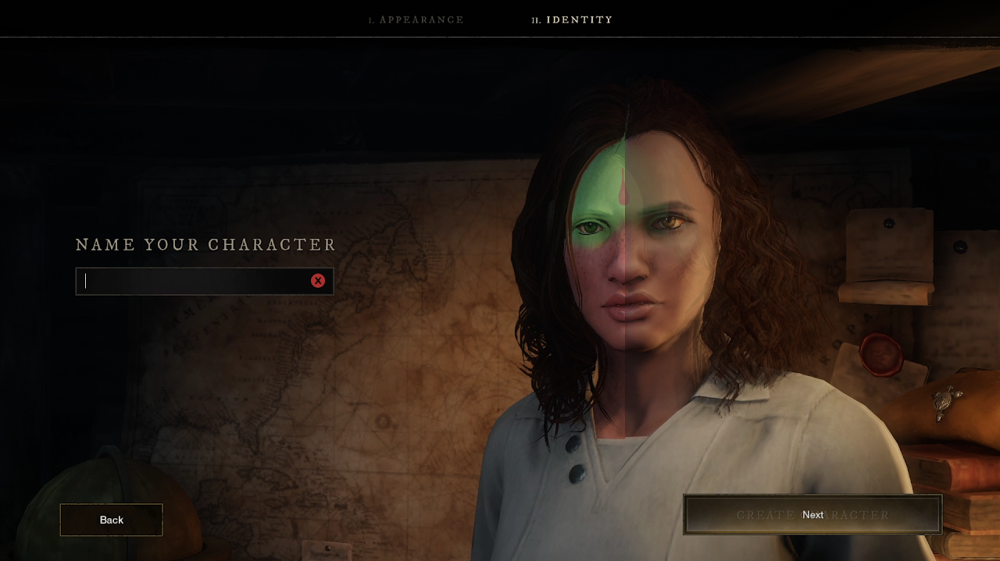
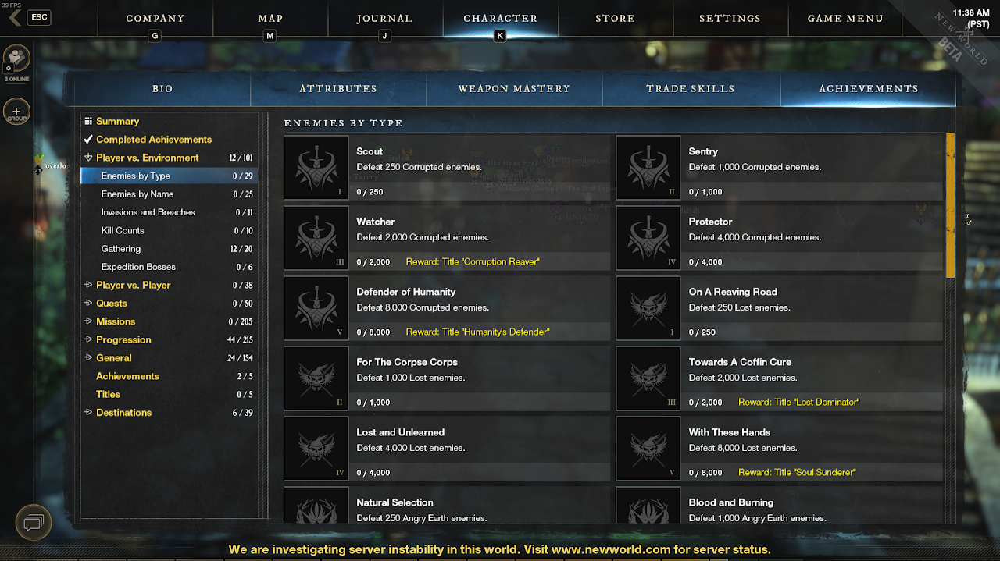
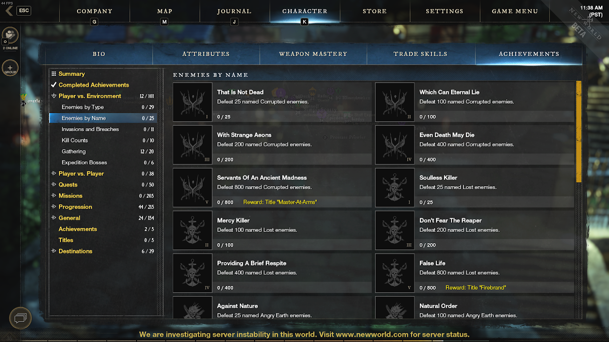
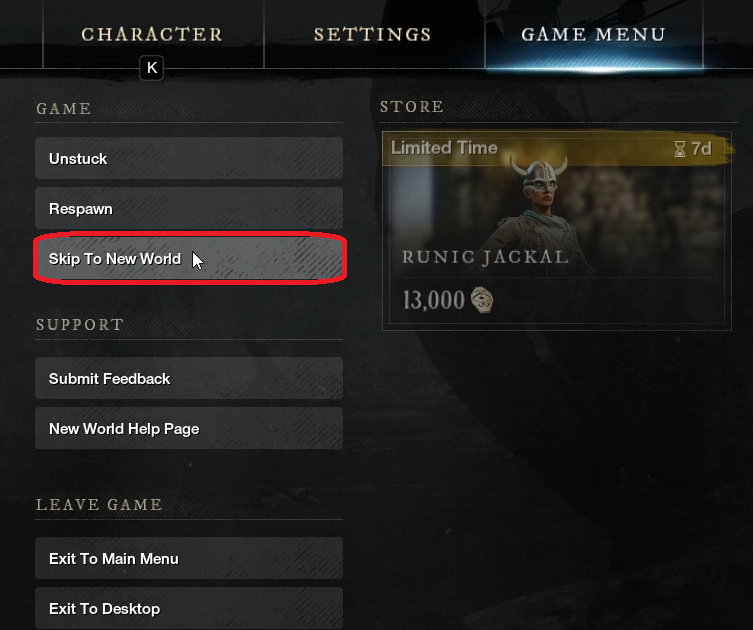
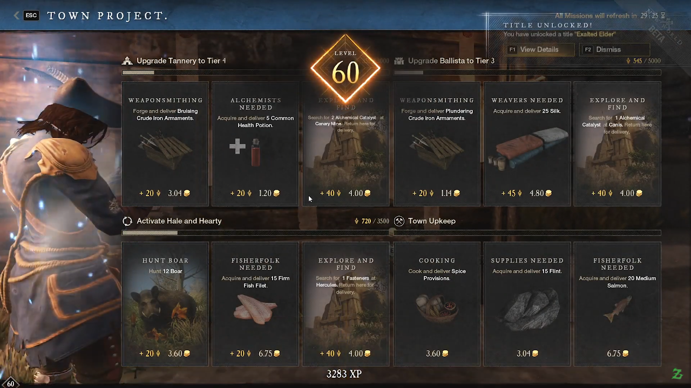
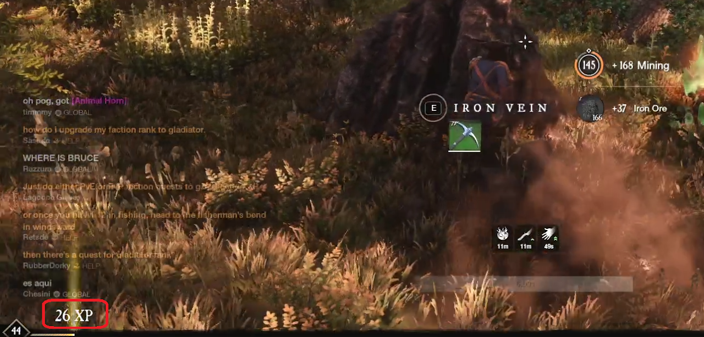
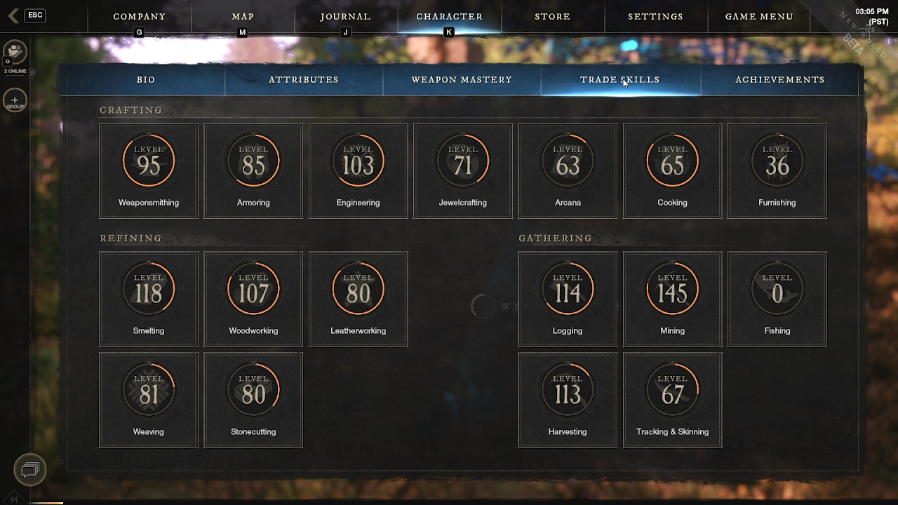
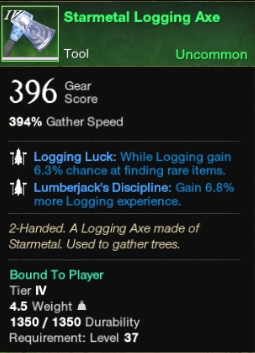
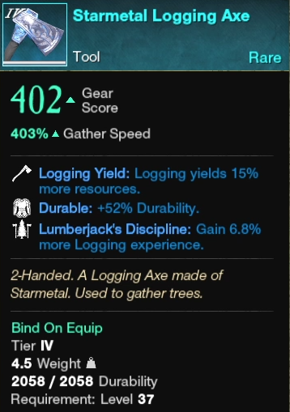
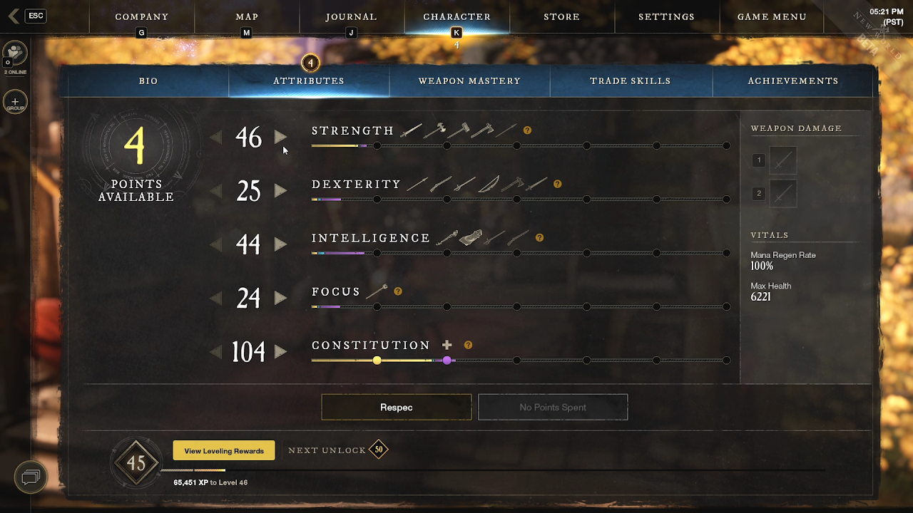

## Playing the Pacifist 
If you are interested in being a Pacifist character, then you are in the right place! Here I will cover everything you would need to know about being a Pacifist in the New World.
The first thing to note is that I feel there are two different kinds of Pacifist types in New World. 
* A "Pure Pacifist", one who doesn't harm anything. (No Fishing)
* A "Pacifist", one who may harm for the sake of living. (Fishing)

## Verifying Pacifist Characters
If you are not worried about the verification of being a Pacifist, you can skip this section. For some its a badge of honor and so I wanted to give a warning to those who seek it out. 

**Achievements in New World are account bound**. Which means if you have a secondary character that has killed things and you've earned a killing achievement, your Pacifist character will also have the killing achievement. This also means you can't delete your character and start over. Once a killer always a killer.

Outside of Achievements, it would be your weapon mastery all 0xp and if you have fishing experience (Pure Pacifist) in your Trade skill or not. 

## Starting your Pacifist Journey
Skip the in game tutorial. Failure to do so will add kills towards your achievement progress and show that you've killed something.

**How to skip the tutorial:**

Acquire the shield from Captain Thorpe and then you can access your Game Menu to select "Skip To New World". This means you must walk up to Captain Thorpe and engage in forced combat to kill a creature (which doesn't count) and then talk to Thorpe.

From this point on you are a free man/woman and can start your pacifist journey in Aeternum! 

## Leveling Up your Character
The major way to level up your pacifist character will be the Town Project Quests. These quest provide you with an amazing amount of Experience and Territory Standing for the zone you are in. The gold you earn is ok. If you want to earn gold use the Trading Post. 

When gathering materials in the world, you will find that you will gain anywhere from 5-35 experience based on the thing you are gathering. The general rule of thumb for this is the less "hit points" the object has the less amount of experience you gain. Small trees that you can chop in 1-2 swings generally give 5xp and the large trees that take 10+ swings generally give 20xp. 

Leveling your trade skills levels your character. Whenever you refine, gather, or craft and level up a trade skill, you will earn experience based on the level you reached. The act of earning trade skill experience doesn't yield character experience; its important to note this because a level 200 trade skill will no longer yield character experience for you.

## Leveling Up your Trade Skills
Use the best gathering tool for your character level. Gathering in New World take time and the higher the tier the longer it takes. Better tools mean you gather faster as it increases your gathering speed. Since you will be doing a lot of this, you want to do it faster. 

There are some tricks to getting a higher tier tool for lower levels. The general idea is to have the lowest gear score possible and have as many perks on the item as possible. The level requirement on items are based on these two things. For each perk on an item, it reduces the required level value by 1. For each Gear Score value there is a required level range.

* Lower Gear Score means lower required level.
* More perks means the item's required level is reduced. 

For example take this Startmetal Logging Axe. The targeted gear score for a Tier 4 item is 400 with a required level 40. This Starmetal Logging Axe is under 400 GS and has 2 perks, thus reducing the level requirement to 37 over the targeted 40. 

To lower the Gear Score value on a craft, you must use lower tier materials in the craft. This Startmetal Logging Axe went below the 400 Gear Score because Tier 2 or Tier 3 Lumber and Leather items were used in the craft. If you use both Timber and Coarse Leather at Engineering level 100; then you could craft a Gear Score 380 Starmetal Logging Axe. Add three perks to this and your required level becomes 33 for the soonest you could use a Starmetal Tool. 

It is important to note that the Gear Score does affect the Gathering Speed modifier. While this is true, you do gain more value out of the Gathering Speed from higher tier than you would gear score. Meaning the soonest you can upgrade in a tier, the better!

## Tool Perks
You will focus more on the tool perks than you will on the gear perks. The gear perks for gathering is really limited to luck while the tool perks have a wide variety to pick from. 

Types of Gathering Perks:
* Harvesting Luck: [5-9.3]% chance to find rare items while harvesting.
  * There are also versions of this for Logging, Mining, and Skinning.
* Harvesting Yield: Harvesting  yields [10-19]% more resources.
  * There are also versions of this for Logging, Mining, and Skinning.
* Horticulture Discipline: Harvesting yields [3-9.4]% more experience.
  * There are also versions of this for Logging, Mining, and Skinning.
* Azoth Extraction: [30-48]% Chance to gain 1 Azoth on finished gather.
* Durability: [20-75%] durability towards the item.

Perk order as I would get them:
* Discipline - Rather straight forward. More Experience the better. 
* Azoth Extraction - Will be helpful for fast traveling and crafting perks into items you want to have perks in. 
* Yield - More resources to work with for leveling. Higher tier items require the use of lower tier so you will always need more of something. 
* Luck - Is really only helpful if you have the luck gear to go along with this.

## Attributes
There are Pacifist and non-Pacifist reasons to put points into your attributes. Every 50 points unlocks a buff for your character that will assist you in both aspects. 

I suggest putting all your points into Constitution. This increases your survivability while out gathering and reduces the durability loss on your tools. There are a few other bonuses that come along with this, but those are the two main reasons I suggest dumping all your points into it. 

