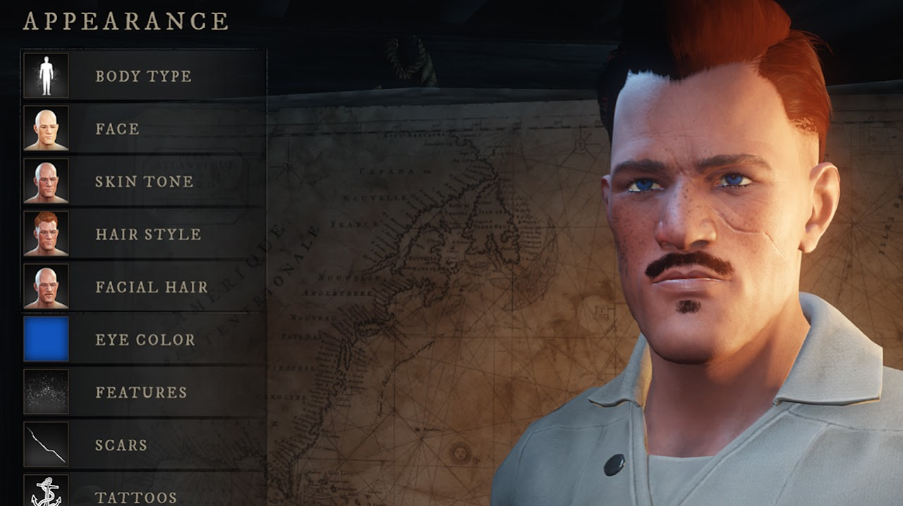

## New Player Guide
Welcome to my new player guide for New World! Here I will go over the basics to help you learn about the game and what you can do. This isn't focused on a pacifist character, but for anyone interested in New World. 

If you have any questions, feel free to join my Pacifist Discord and ask questions there!

## Startup Menu
When you first launch New World and you log into the system you are greeted with the start-up menu. This area contains content updates (patch notes), forum links, and other information directly related to the game. Selecting a square will launch your default web browser and goto the related webpage.

## Character Screen
After selecting continue from the Startup Menu you are shown your character screen. Before you make your character, make sure you have your REGION set correctly. (US West, US East, EU, Australia, and South America) You want to select the best region based on your location for the best game play experience. After your region is correct you can select Create Character and figure out how you want to look in game!

## Character Creation
When creating a new character you have a bit of options to select to figure out the best character for your interest. You can select your body type (masculine or feminine), how your face looks, skin tone, hair style, facial hair, eye color, birth marks, scars, tattoos and the color of those tattoos. 

Finalize your character and give them a name. You can use spaces in your name so if you wanted a first name and surname you can! (Limited to 14 characters though)

## Game Tutorial
Right after finalizing your character you are thrown into a cut scene and your tutorial starts. Players have the option to skip the tutorial in the menu once you can access it, however this is only suggested if you've already completed this once before. The tutorial is rather straight forward and teaches you the basics about the game. Attack, dodge, block, moving, inventory, equipping items, and weapon mastery. 

## Spawning on the Beach
After the game tutorial is completed you wash up on the beach in one of four locations; Monarch's Bluffs, First Light, Everfall or Windsward. From here you are free to do whatever you want to your heart's content, however it is suggested to head to the closest outpost from where you spawned. Generally speaking it is directly in front of you, where you will find an NPC that will assist you with completing your Main Story Quest (MSQ). 

## General Overview
From here I will provide you with some general information that will assist your game play experience in the New World. Things like the leveling system, attributes, equipment, storage, professions, game mechanics, and more!

## Character Resource Bars
Your character uses 3 major resources; Health, Mana, and Stamina.

* Health: White bar means full health otherwise it will show red. Reach 0 and you will enter Death's Door. Death's Door is where you are downed waiting for someone to pick you up. While down you have temporary hit points that slowly decrease. If that reaches 0 then your character dies and you have to respawn.
* Mana: A spell caster's resource to use magical spells. Full mana doesn't show while out of combat. Naturally recovers over 50 seconds. Can be completely ignored if you don't plan to play a spell caster. 
* Stamina: A small yellow bar that appears above your health. It is used to Dodge, Block and throw weapons. Regenerates in 3 seconds. You can't regenerate stamina while blocking. Regeneration starts 1 second after an action that consumes stamina. 

## Social Window
* Walk up to a player and press H to open the social window.
* Quick options to whisper or group invite.
* Request duels, trading, and friends.
* Options to mute, block, and report. 

## Trading
* Can not drop items to trade. Must use the social window to trade.
* Items on ground is player based and disappears after 3 minutes.
* Can trade up to 10 items at a time. With or without gold. 
* Both parties must agree to the trade for it to finish.
* Can send gold without using the trade window. (Click gold in your bags)

## Leveling
* Character level cap is 60.
* You gain experience for doing just about anything; crafting, gathering, quests, killing monsters, exploring, reading lore notes and more.
* You gain attribute points [2-5] when you level up. 
* Level requirements to equip items based on gear score. 
* Leveling will unlock different features and game content (see below).

**Level Unlocks**
* Unlock different milestones every 5 levels.
* Can view level unlocks in game by clicking "View Leveling Rewards" in your attributes window.
* Level 5: Second Weapon Slot. T1 Camp Quest.
* Level 10: Duels. First Bag Slot
* Level 15: First House. T2 Camp Quest. 3rd Consumable Slot.
* Level 20: Ring Slot. T1 Azoth Staff Quest.
* Level 25: T3 Camp Quest. 4th Consumable Slot.
* Level 30: 2nd Bag Slot. T2 Azoth Staff Quest.
* Level 35: Second House.
* Level 40: Earring Slot. T3 Azoth Staff Quest. T4 Camp Quest.
* Level 45: 3rd Bag Slot.
* Level 50: Invasions.
* Level 55: T5 Camp Quest.
* Level 60: Outpost Rush (PvP Battleground)

## Weapon Mastery
* Gain experience by using the weapon in combat. 
* Weapon level cap is 20. 
* Earn 19 weapon points as you level your mastery. 
* Each weapon has 2 talent trees with an ultimate. 
* Requires 10 points in a talent tree to unlock ultimate.
* Can only unlock 1 ultimate due to these limitations. 
* Can only equip 3 abilities per weapon at a time.  

## Weapon Scaling
Weapon scaling is how the weapon's damage is affected by your attributes. Its important to use a weapon based on how you plan to allocate your attributes or you will have a rough time killing monsters. 

* Warhammer: 100% from Strength
* Great Axe: 100% from Strength
* Bow: 100% from Dexterity
* Fire Staff: 100% from Intelligence
* Life Staff: 100% from Focus
* Ice Gauntlet: 100% from Intelligence
* Sword & Shield: 90% from Strength and 65% from Dexterity
* Rapier: 90% from Dexterity and 65% Intelligence
* Hatchet: 90% from Strength and 65% Dexterity
* Spear: 90% from Dexterity and 65% from Strength
* Musket: 90% from Dexterity and 65% from Intelligence

## Weapon Damage Types
This is the breakdown of the major damage types for the weapons. Some weapons can do other types based on their abilities selected.

* Slashing: Straight Sword, Hatchets, and Great Axes.
* Thrust: Muskets, Spears, Bows, and Rapiers.
* Strike: Warhammer. 
* Elemental: Gauntlets and Staffs.
  * Frost, Nature, Fire, Void, Lightning, & Arcane.

## Resistances & Vulnerabilities
Every enemy type have a specific damage type that they are resistant or vulnerable to. Additional damage is increased by 15% when they are vulnerable to it. The same applies for being resistant a 15% reduction. Resistant and vulnerable both show up/down arrows when it is being applied. Color is shown too; however a critical will always show orange even if resistant/vuln. 

* **Corrupted**
  * <u>Resistances</u>: Frost and Strike.
  * <u>Weaknesses</u>: Arcane, Nature and Thrust.
* **Ancient**
  * <u>Resistances</u>: Fire and Slashing.
  * <u>Weaknesses</u>: Lightning, Void, and Strike. 
* **Lost** 
  * <u>Resistances</u>: Void and Thrust.
  * <u>Weaknesses</u>:  Frost, Lightning, Nature, and Strike.
* **Angry Earth**  
  * <u>Resistances</u>: Lightning, Nature, and Thrust.
  * <u>Weaknesses</u>: Fire and Slashing.
* **Beast** 
  * <u>Resistances</u>: None
  * <u>Weaknesses</u>: Thrust

## Attributes
Strength, Dexterity, Intellect, Focus, Constitution are the character attributes. 

* Diminishing returns after 300 attribute points in a single stat.
* 500 is the most one can have between gear and levels.
* Every 50 points into an attribute unlocks a bonus. (See below)

**Strength**
* 50 Points: 5% damage to melee weapon light attacks. 10% mining speed.
* 100 Points: 10% damage to melee weapon heavy attacks. 20 encumbrance.
* 150 Points: 50% stamina damage from melee weapon light and heavy attacks. 10% decreased weight of mined items.
* 200 Points: 10% damage on crowd controlled enemies. 10% mining speed.
* 250 Points: Stamina regeneration continues while light/heavy attacking with melee weapons. 10% yield increase when mining.
* 300 Points: Light and heavy attacks with melee weapons gain Grit. 25% chance to fully mine a node when swinging.

**Dexterity**
* 50 Points: 5% chance to critical hit. 10% skinning speed.
* 100 Points: 5% piercing damage. 20% haste after skinning for 3 seconds.
* 150 Points: Dodging cost 10 less stamina. 10% decreased weight of skinned items.
* 200 Points: 10% backstab and headshot damage. 10% skinning speed.
* 250 Points: 10% bonus critical hit damage on crowd controlled enemies. 10% yield increase when skinning.
* 300 Points: Ammo has a 15% chance of being returned. 100% crit chance after dodge roll.

**Intelligence**
* 50 Points: 10% damage to light and heavy magic attacks. 10% harvest speed.
* 100 Points: 10% critical hit damage. 5% chance to obtain 1 Azoth while harvesting.
* 150 Points: 15% elemental damage. 10% decreased weight of harvested items.
* 200 Points: 10 mana after a dodge. 10% harvesting speed.
* 250 Points: 30% duration to damage over time spells. 10% yield increase when harvesting.
* 300 Points: 30% damage on first hit on full health enemies. 10% reduction on Azoth travel cost.

**Focus**
* 50 Points: 10% mana regeneration rate. 10% fishing line tension
* 100 Points: Extra 20 mana to your mana pool. 10% yield increase when salvaging
* 150 Points: 20% healing output. 10% decreased weight of fishing items
* 200 Points: 20% duration on casted buffs. 10% fishing line tension
* 250 Points: Extra 30 mana on any self or group kills. 10% increased size of fish caught
* 300 Points: When reaching 0 mana, gain 200% mana regen for 10s. (60s cooldown) 10% cooldown reduction for Inn fast travel

**Constitution**
* 50 Points: All health consumables last 20% longer. 10% logging speed.
* 100 Points: Increase max health by 10% of physical armor rating. 10% reduction on durability loss for tools.
* 150 Points: 10% reduction to critical damage taken. 10% decreased weight of logging items.
* 200 Points: 20% increase to armor. 10% logging speed
* 250 Points: 80% damage reduction when at full health. 10% yield increase when logging
* 300 Points: 20% duration of crowd control effects when applied. 25% chance to chop a down a tree in a single swing

## Equipment
* Physical Armor Rating helps mitigate physical attacks (Ranged/Melee)
* Elemental Armor Rating helps mitigate magical attacks (Spells/Magical Weapons)
* Armor Ratings scale off Gear Score.
* Gear Score determines required level to equip.
* Equipment have different color rarities; Common, Uncommon, Rare, Epic, and Legendary.
* Rarity is determined by the number of Perks & Sockets on the item. 

**Equipment Naming**
* Different Prefixes and Suffixes for gear.
* Prefixes are based on the material used to craft the item. (Cloth, Leather, & Metals)
* Cloths for light gear, leathers for medium gear, and metals for heavy gear.
* Suffixes determine the attributes on the gear. 
* There are 25 different Suffixes that determine attributes on gear.
* Pure Suffixes applies 1 attribute to the gear.
* Hybrid Suffixes applies 2 attributes. (Primary/Secondary)
* Named gear doesn't use Prefixes/Suffixes and is focused for a certain role.

**Weight Classes**
* Light, Medium, and Heavy weight categories based on your equipment.
* This includes the shield. Even if you aren't using the straight sword. 
* Bags in your inventory don't count towards your weight category. 
* Light, mostly cloth, category is mostly mobility and little mitigation.
* Medium, mostly leather, category is a balance of mobility and mitigation.
* Heavy, mostly metal, category is mostly mitigation and little mobility.
* Light bonuses: Dodge further range and deal 20% bonus damage.
* Medium bonuses: Dodge is a quick hop. Deal 10% bonus damage. Crowd control debuffs last 10% longer when you apply them. 
* Heavy bonuses: Dodge is a side step. Block stability is increased 15%. Crowd control debuffs last 20% longer when you apply them. 

## Inventory Weight
* Character starts with 200kg capacity.
* Unlock 3 bag slots as you level.
* Bags can have perks to improve quality of life. 
* Requires Rune of Holding to craft bag. (Buy from faction vendor)

## Storage Weight
* Every settlement has a storage shed that you can store items.
* Storage sheds hold 1000kg and can be increased with territory bonuses. 
* Transfer goods between sheds if both zones are controlled by your faction. 
* Check goods using world map and click settlement that has storage shed. 
* Craft using materials from the storage shed. Doesn't need to be on player.
* No fee to store items or access the shed are you at. 

## Professions
* All trade skills cap at level 200. 
* There are 3 major types of professions; gathering, refining, and crafting. 
* Gain experience by gathering, refining, or crafting respectfully. 
* High level crafts have cool-downs. 

**Gathering** 
* Logging: Cutting down trees for wood.
* Mining: Hitting rock nodes for ore.
* Harvesting: Cutting plants for herbs and food.
* Tracking & Skinning: The slicing of skins and furs.
* Fishing: Catching of fish.
* Gathering tools are required to gather. (Exception Tier 0 bushes/flint)

**Refining**
* The conversion of raw materials into craftable items.
* Uses 5 different refining stations in a settlement. 
* Smelter: Converts wood into charcoal and ore into ingots.
* Woodshop: Converts raw wood into refined wood. (Timber/Lumber)
* Tannery: Cures skins and hides.
* Loom: Combine plant fibers into a weave.
* Stonecutter Table: Refining of gems and stone.

**Crafting**
* Uses 5 unique crafting stations.
* Crafting stations change looks as they are upgraded in tier. 
* Arcana: All things magical; staffs/gaunlets, potions, coatings, and tinctures.
* Cooking: All things food; attribute buffs, mana and health slow restore.
* Armoring: All things armor; light/medium/heavy it does it all.
* Weaponsmithing: Straight sword, great axe, rapier, and war hammer.
* Engineering: Tools, bows, muskets, hatchet, and spear. 
* Jewelcrafting: Rings, amulets, and earrings.
* Furnishing: Housing items; rugs, chairs, tables, storage chests, and more.
* Add Azoth to increase crafting chances of attributes, gem slots, and perks.

## Enemies of New World
5 enemy types. Each weak to something different.
* Lost: Mindless undead; drowned, withered and banshees. 
* Ancients: Skeletons. Original occupants of Aeternum. 
* Corrupted: Humans possessed by evil magics. Generally red eyed. 
* Angry Earth: Creatures that mimic the living, but are of the land. Wooden.
* Beasts: Normal everyday creatures like bears, wolfs, elks and more. 

## Elite Monsters
* All named enemies above level 15 use the Elite System.
* Can have 1-3 different traits.
* Known traits: Offensive, Defensive, and Utility. 
* Each trait changes the attack, characteristics, and difficulty levels. 

## Higher Level Enemies
Higher level enemies gain buffs based on the level difference.
* 3 Levels Higher: Armor buff
* 5 Levels Higher: Damage buff
* 6 Levels Higher: No Death's Door & increased perception range of 10 meters.
* 10 Levels Higher: Can't be staggered. 

## Territories
* There are 14 different territories in game.
* Only 11 of them can be player/company controlled. 
* Gain standing points by being active in the corresponding zone.
* Every territory is independent. Territory Level/Bonuses unlocked are limited to the area that you unlocked them at.
* Requires you to be in a faction to control a territory.
* Able to declare war on other factions that control a territory.
* There are many rules to declaring war, only happens at most once a day.

**Territory Bonuses**
10 Different kinds of bonuses you can unlock in a territory.
* XP Gain: Earn a % more experience while in the territory. 
* Gather: Increased gathering speed by % while in territory. 
* Standing Gain: Earn % more territory standing while in territory. 
* Storage: Increase settlement's storage by x amount.
* Station Tax: Decreases crafting fees.
* Trading Tax: Decreases trading fees.
* Property Tax: Decreases property fees.
* Faction Tokens: Earn more faction tokens. 
* House Ownership: Purchase a house in the settlement.
* House Item: Increase decorative items in house by 1. 

## Factions
* 3 different player factions.
* Required to PvP. 
* Marauders: Military style that wants a free nation.
* Syndicate: Secretive style that loves forbidden knowledge.
* Covenant: Religious style that want to purge the lands of heretics. 
* Follow your main story quest (MSQ) to join a faction.
* Faction vendors to spend faction tokens.
* Possible to change factions every 120 days to the non-dominate one. 

**Faction Influence**
* Territory color indicates what faction owns the zone.
* Bars under the zone's name shows each faction's influence.
* Complete flagged PvP quests in zone to change influences.
* Can change influence by killing flagged players or doing PvP quests.
* "In Conflict" means a company faction may declare war for the territory.
* Other company factions may declare war as well. Weighted selection.
* A Vanguard will be selected from the list of companies that declared war.
* Vanguard will be in charge of selecting fighters for the 50 vs 50 war. 

**Companies**
* Company is a player owned group. (Guild/Clan)
* To form a company it must have a name and a logo.
* Company is bound to the faction of the creator.
* Can only recruit same faction members.
* Maximum company size is 100.
* Governor is the leader of a company. (Guild master)
* Governor has all the tools required to run a company and a territory. 
* They can set taxes, pay upkeep, and determine settlement upgrades.
* Consul are officers with similar permissions as the governor.
* They can manage territories and the company.
* Members are the rest of the players in a company that are there to help.

## Expeditions
* PvE dungeons players may run for experience and loot.
* Requires at least 3 players, but suggested 5 man. 
* Requires Azoth Staff from MSQ and consumes Tuning Orb. 
* Use teamwork to solve puzzles and kill enemies.
* Fight bosses and mini-bosses along the way.
* About an hour in length.

**Tuning Orbs**
* Tuning Orbs are crafted at the stonecutting table with stone cutting. 
* Different kinds of tuning orbs. Make sure to craft the right one!
* There is a cool-down to craft a tuning orb.
* Requires items that are bound to character to craft.

